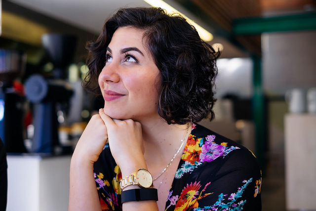

  

Una is a front end developer on the IBM Design team in Austin, TX. She blogs, illustrates, is a core member of the Open Design Foundation, and started the DC and Austin Sass Meetups. Una’s talk, **_Photoshop is Dead: Editing Images in CSS_**, will demonstrate how we can use CSS blend modes, filters, and gradients to implement custom photo effects right in the browser. The talk will help us understand how blend modes work and will show us how to implement dynamic and accessible graphics within our own web projects.

We approached Una to talk to her about work, CSS, and what she's been up to lately:

Hi Una! Thanks for taking the time to answer some questions for us. Besides being busy speaking at conferences, what are you working on at the moment?
I’m always doing a million things! Right now, I am probably somewhere in Europe trying to figure out what my next move is to get me to Berlin on time. But outside of this, I’ve been working on building prototypes of Cloud Platform offerings at IBM, helping define the engineering and design workflow/culture, and organizing internal and external meetups. Apart from coding and writing, I’ve been doing a lot of watercolor painting and calligraphy lately. I failed to complete a 100-day lettering challenge, but I’m still working at it, and you can follow my struggle [here](https://instagram.com/unadoestype/).

What is an upcoming CSS feature that you can’t wait to see widely supported by browsers?
I’m really hoping that browsers will implement [conic gradients](http://leaverou.github.io/conic-gradient)! They’re so versatile and can be used for so many things, from checkerboard patterns to pie charts.

Can you think of a demo that recently blew your mind? Something on codepen, or github, or…?
[Lucas Beber](https://twitter.com/lucasbebber) is always blowing my mind with his demos. He recently created **[this one](http://codepen.io/lbebber/pen/ZGGNvZ)** of pure CSS water droplets with focus options that even shake on screen resize. Amazing!

Do you remember the first project you wrote CSS for? Is it still online?
Wow. My first project was a terrible, terrible website for a school project that was for a fake Travel website. I remember it was before webfonts and before I realized the joys of padding. I had a paragraph of black text in Verdana set on a yellow background that stretched to 80% of the page. Not cute. I’m glad it’s hidden somewhere deep on a USB drive somewhere.

What’s the thing you like most about your job?
Solving large-scale problems is a rewarding challenge I get to explore at IBM, but my real favorite part of work is my co-workers. I love the people I get to surround myself with. They’re all fantastic, curious individuals who I learn from and teach things to on a daily basis. To me, the most important part of a workplace is the people you get to work with and the flexibility to determine what tools and techniques you get to use to solve a problem.

Have you been to Berlin before and what are you looking forward to the most?
I have! I was in Berlin during Christmas time 3 years ago. It was amazing! :) The Christmas markets and gluvine were wonderful and I really enjoyed exploring the city (it’s such beautiful and eclectic place). I’m looking forward to returning at a warmer time and meeting all of the wonderful tech people in Berlin!

We look forward to meeting Una and are really excited ot hear her talk! In the meantime, follow [@una on Twitter](https://twitter.com/una) or check out her writings on her website at [una.im](http://una.im).
